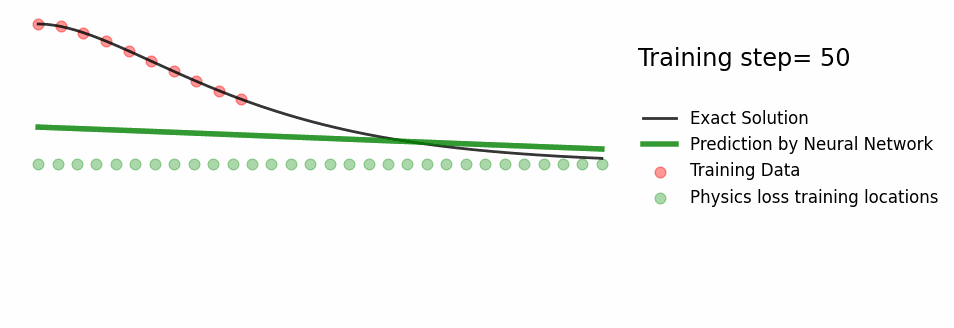

# Oscillator-pinn
This includes the code accompanying Benmoseley's blog post: [So, what is a physics-informed neural network?](https://benmoseley.blog/my-research/so-what-is-a-physics-informed-neural-network/). 
In addition, **critically damped response** for the oscillator is also included in this forked repository.

## Result of PINN in critically damped harmonic oscillator

